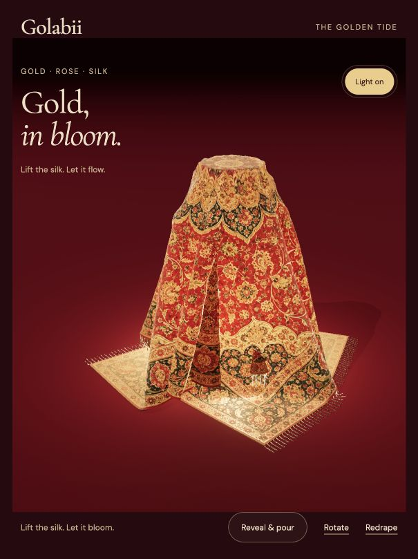
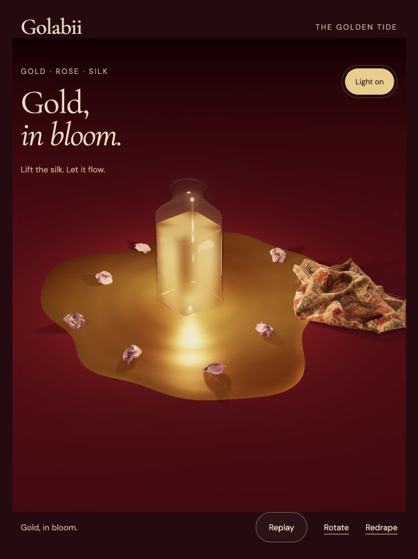

# Continue the golden bottle reveal

Repository: https://github.com/hajattack/golabii
Branch: `design/molten-gold-bottle`
Starting website commit: `8ac64e77332a127e524e2fb31dd5e1a38c45fd4e`

## Start here

This branch contains the current working website and editable 3D sources. Continue on this branch, or create a new branch from it for your changes. Do not merge into `main` or deploy unless the user asks.

```sh
git clone --branch design/molten-gold-bottle https://github.com/hajattack/golabii.git
cd golabii
python3 -m http.server 8770 --bind 127.0.0.1
```

Open http://127.0.0.1:8770/scenes/rug-burgundy.html and press **Reveal & pour**. Use a different port if 8770 is already occupied. The homepage is `/`. This is a static website; there is no npm install or build step. Serve over HTTP so JavaScript modules and GLBs load correctly.

## Current approved direction

- Burgundy background, gold rug reduced by 10% in width and length.
- Clear, rounded French square bottle: 240 × 96 × 96 mm.
- Warm interior light visible beneath the rug.
- Deep amber-to-gold metallic liquid and exactly eight copies of the supplied flower OBJ.
- After the rug fully clears the bottle, gold rises and flows along its sides into a spreading puddle. Flowers emerge in sequence, then float across the surface while avoiding the displaced rug.
- Keep manual dragging, keyboard interaction, rotation, light controls, replay, redrape, and reduced-motion behavior working.

## Where to edit

- `scenes/rug-burgundy.js`: cloth simulation, reveal controls, camera, clearance gate, integration.
- `scenes/gold-overflow.js`: glass/liquid appearance, light, stream and puddle geometry, flower rendering.
- `scenes/overflow-motion.js`: timing, flower paths, puddle footprint, clearance checks.
- `scenes/rug-burgundy.html`: focused scene layout, labels, import map.
- `scenes.js` and `index.html`: homepage integration and cache versions.
- `scenes/french-square-bottle.glb`, `scenes/user-flower.glb`: optimized runtime models.
- `scenes/gold-drape-small.bin`, `scenes/gold-collision.json`: prepared cloth state and bottle collision envelope.
- `design/gold-overflow/`: source OBJ, editable `.blend` files, complete initial-state GLB, Blender rebuild scripts, previews, and previous validation reports.
- `GOLD-OVERFLOW.md`: implementation details and limitations.

Website scale is 10 scene units per metre. Blender source models use metres; GLB exports use Y-up. The normalized reusable flower is 1 metre wide, scaled to 38 mm in the bottle. Eight copies share one mesh. The source OBJ lacked its MTL; the new rose-pink finish is intentional.

## Verify changes

With a recent Node.js version supporting ES modules:

```sh
node --check scenes/rug-burgundy.js
node --check scenes/gold-overflow.js
node --check scenes/overflow-motion.js
node scripts/check-gold-overflow.mjs
git diff --check
```

In the browser, check covered glow, partial dragging (no premature overflow), full reveal, eight flowers floating, light toggle, replay, and redrape. Check a narrow phone viewport as well as desktop. These interactions were checked before this handoff; physical-phone performance has not been benchmarked.

`scripts/settle-small-rug.cjs` can regenerate the prepared 90%-size rug with `node scripts/settle-small-rug.cjs`; it overwrites `scenes/gold-drape-small.bin`. Update this generator if you change the corresponding cloth parameters in the scene.

The Blender 4.5 scripts in `design/gold-overflow/` rebuild the normalized flower and the editable bottle arrangement from sibling source files. They replace the currently open Blender scene. The web materials include custom shaders and lighting, so Blender rendering is not an exact preview of the browser.

## Known limits

Overflow is a procedural real-time visual animation, not a baked or volume-conserving fluid simulation. The `.blend` and combined `.glb` contain the editable initial arrangement; they do not contain the website overflow animation. Cloth motion is simulated separately. Fabric light transmission is approximated for the web.



